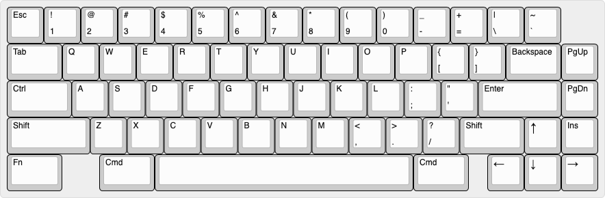
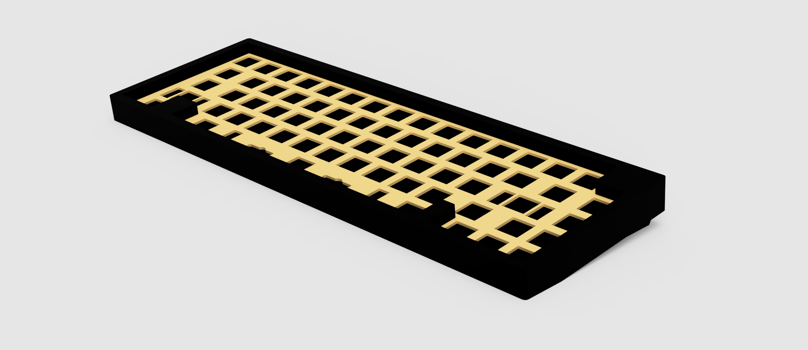
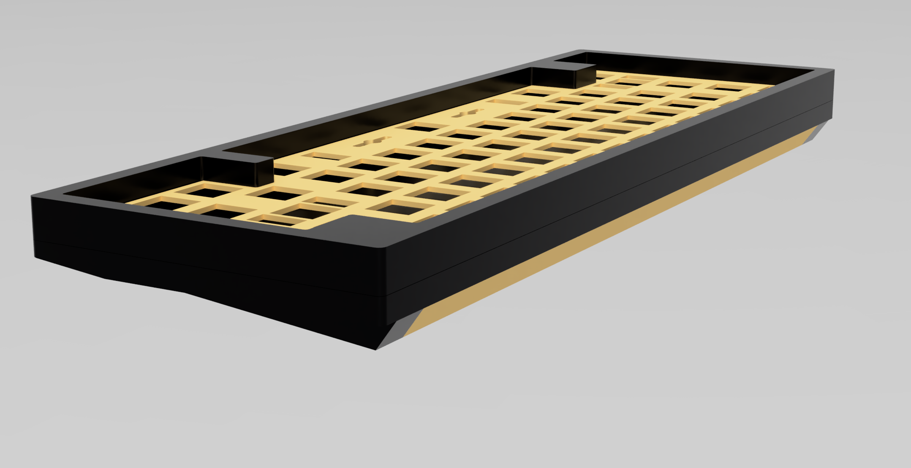
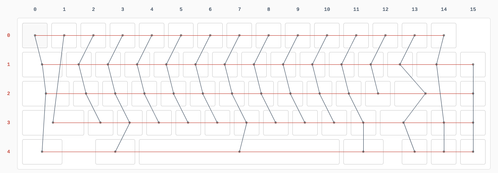

# 65_keyboard_untitled

My as yet unnamed 65% keyboard design

## Project structure

- [`layouts`](layouts/) - contains all the layout options I explored and the related artifacts. Generated using [Keyboard Layout Editor](https://www.keyboard-layout-editor.com)

## Layout

**tl;dr - pretty standard 65% layout WKL bottom row and split backspace**

This keyboard is a 65% board. Which means it's basically a 60% layout that's been extended by 1 column which allows us to comfortably incorporate an arrow cluster and a couple of the useful navigation keys. It's a fixed layout because it's being built just for me as a personal project. So don't expect any allowances in plate or case design for other layouts.

It's using a HHKB style layout (ANSI base with split backspace, Esc next to the 1), a Winkeyless style bottom row with a 7u spacebar, and a 1u logo blocker in the top right (because aesthetics). The right shift has been shrunk to 1.75u to allow for the up arrow. It looks like this:

## Process

1. Decide on your layout using KLE. don't forget to either download the JSON or save your layout to Github. NOTE: To make the process easier later. I'm using the Tsangan layout to generate the platefile dxf. Tsangan is the same as WKL but with a 1u key instead of a blocker on the left side modifiers. I'm generating it this way as it makes the top case easier to design as it gives me the markings for the key that I can use as anchors in my cad program to situate the blocker.
2. copy the raw data from KLE into Swillkb. Choose cutout type and stab type - I chose simple square switch cutouts and combined cherry/co-star stab cutouts - I'm going to make the stab cutouts bigger later anyway as I want to use PCB mounted stabs.
3. Get Fusion 360 and follow along Quantriks case video, it's really good. I think I probably re-did my case 2 or three times as I understood more about Fusion in each step of the process. Also modify the design. I made the bottom/weight different as I didn't like the design in the video that much and I changed up the screw positioning and plate mounting stuff a bit. NOTE: There's no USB cutout at this point, I haven't decided where I want it yet, and there's no PCB
4. Design a PCB Schematic in KiCad. I followed along with MrKeebs videos and cross references against avrforums and some other places on the internet to verify my design. Some caveats
  - I'm using ai03's keyboard switch symbol and footprint library. I really wanted to just use the built in KiCad footprints but they don't come with a 7u spacebar, which mine is (and also has flipped stabilizers)
  - I chose the matrix layout based on the connection diagram from the kbfirmwarebuilder. I don't really know how to design a matrix other than to keep the connections as short as possible, so I went with the path of least resistance (badum tish)

## Obligatory Potato Renders

My Thinkpad struggled hard with these...

## KBFirmware Matrix map

## Resources

### Videos/reading material

- Quantrik's 65% Keyboad Case design with Fusion 360 stream
  -  https://www.youtube.com/watch?v=4P0zfLLblOw
- Mr Keebs and Gondolindri's PCB design stream series
  - https://www.youtube.com/watch?v=Nk0egpDFqRA
  - https://www.youtube.com/watch?v=beyh0__tf5M
  - https://www.youtube.com/watch?v=pllksuZwJL0

### Tools

- Keyboard Layout Editor
  - http://www.keyboard-layout-editor.com/
- Swillkb's Plate CAD builder
  - http://builder.swillkb.com/
- MrKeebs PCB Layout Creator
  - http://kbpcb.mrkeebs.com/
- Keyboard Firmware Builder
  - https://kbfirmware.com