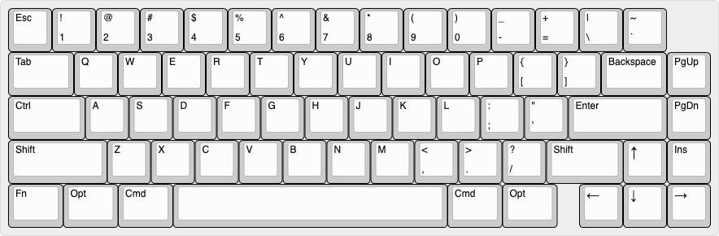
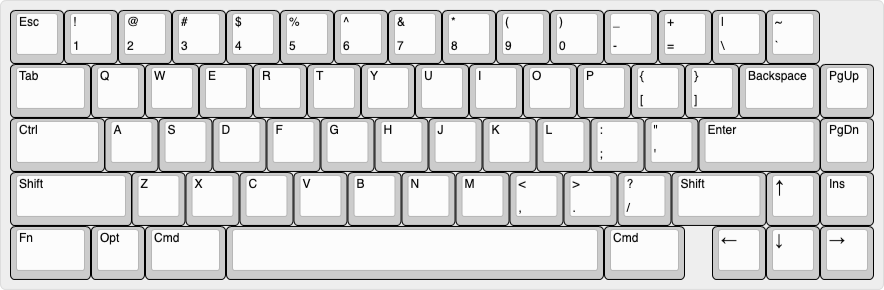
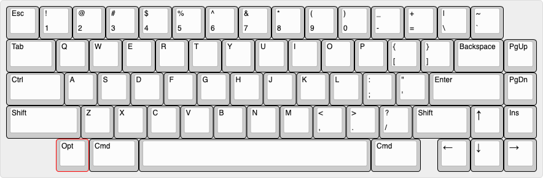

# 65_keyboard_untitled

My as yet unnamed 65% keyboard design

## Layout Options

### 1. Full Normal layout

1.25u bottom row modifiers. 6.25u spacebar

### 2. Tsangan bottom row

1.5u and 1u mods, 7u space

### 3. Winkeyless bottom row

1.5u mods, 7u space with a 1u blocker to balance

### 5. HHKB inspired bottom row

1u, 1.5u mods, 7u space

